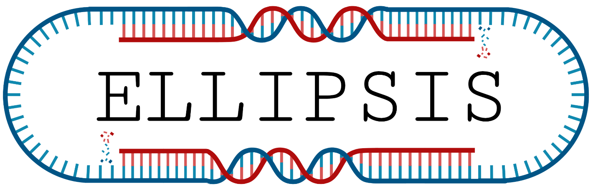

<p align="center"></p>

## Plasmid assembly, gene identification and annotation pipeline

Ellipsis will run hybrid assembly and identify the plasmids and chromosomal sequences in these assemblies.
Then, it will identify potential virulence and resistance genes among these sequences, and report them. 
The pipeline has four different tracks:

- Hybrid assembly track

   Runs hybrid assembly and gene detection/annotation (red arrows in figure)

- Draft assembly track

   Runs draft assembly (short reads only) and gene detection/annotation (blue arrows in figure)

- Annotation track

   Only runs gene detection/annotation on input assemblies (everything below and including MOB-recon in figure)

- Plasmid mapping pipeline (PlasMap)

   Runs plasmid screening on the input reads, based on supplied reference sequence

## Overview of pipeline


## Input data structure
If using either of the assembly tracks of the pipeline, the reads need to have a specific naming convention in order to match in the pipeline.
Overall, **avoid using dots (.) in the read file names,** except at the end (.fastq.gz).
For short reads, the following naming convention must be followed:
```
*_R{1,2}.fastq.gz
```
Where the "*" represents the sample ID. For long reads, the following convention must be followed:
```
*.fastq.gz
```
Where "\*" must exactly match the "\*" in the short reads. 

## How to run
To run the pipeline, copy the main.config or the plasmap.config file and edit it to your needs.
Then, run the following:

```
To run Ellipsis main pipeline:
path/to/ellipsis.sh main config_file.config output_folder

To run PlasMap pipeline:
path/to/ellipsis.sh plasmap plasmap.config output_folder
```
Java is automatically activated and deactivated.

## Output folders

- config_files

   Contains the config file used and the main.nf file used in the run

- results

   Main results from each process

- reports

   Collated reports from all relevant processes

Håkon Kaspersen,
12.11.2020
