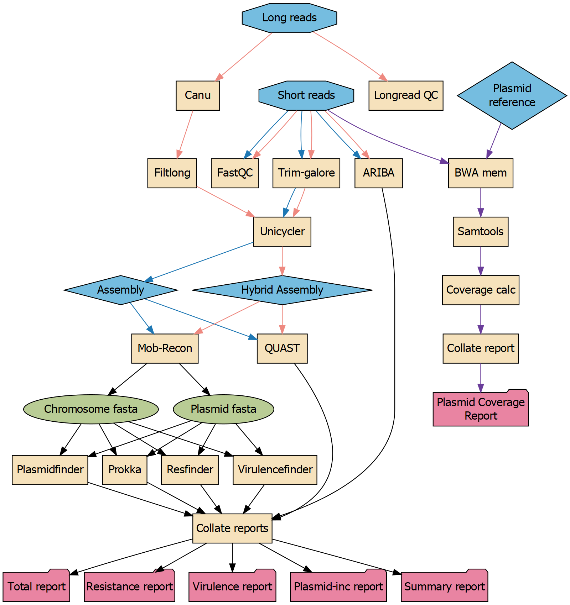

# Ellipsis
## Plasmid assembly, gene identification and annotation pipeline

Ellipsis will run hybrid assembly and identify the plasmids and chromosomal sequences in these assemblies.
Then, it will identify potential virulence and resistance genes among these sequences, and report them. 
The pipeline has four different tracks:

- Hybrid assembly track
	Runs hybrid assembly and gene detection/annotation (red arrows in figure)

- Draft assembly track
	Runs draft assembly (short reads only) and gene detection/annotation (blue arrows in figure)

- Annotation track
	Only runs gene detection/annotation on input assemblies (everything below and including MOB-recon in figure)

- Plasmid mapping pipeline (PlasMap)
	Runs the plasmid mapping pipeline, which calculates the percent coverage of reads after mapping to a plasmid sequence (separate from the main pipeline)

## Overview of pipeline



## How to run
To run the pipeline, copy the main.config file and edit it to your needs.
Then, run the following:

```
To run Ellipsis main pipeline:
path/to/ellipsis.sh config_file.config output_folder

To run PlasMap pipeline:
path/to/plasmap.sh plasmap.config output_folder
```
Java is automatically activated and deactivated.

## Output folders

- Config files
	Contains the config file used and the main.nf file used in the run

- results
	Main results from each process

- reports
	Collated reports from all relevant processes

Håkon Kaspersen,
12.11.2020
